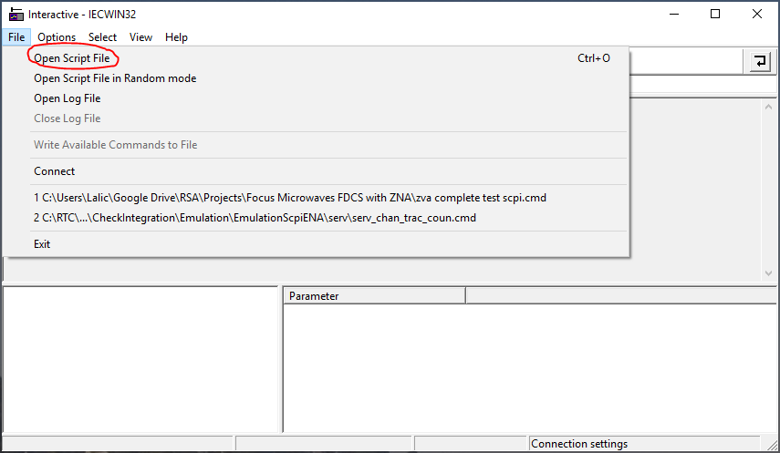

# Process NI IO Trace

A small utility for converting `Capture.txt` files from NI IO Trace into simple, usable text files.

## Requirements

Requires python 3+

## Rohde & Schwarz IECWIN32 (GPIB Explorer) Scripts

R&S IECWIN32 scripts can be created with the following arguments:

`process-ni-io-trace --write-only Capture.txt scpi_commands.cmd`

The resulting `scpi_commands.cmd` file is in a format that can be executed as follows:

